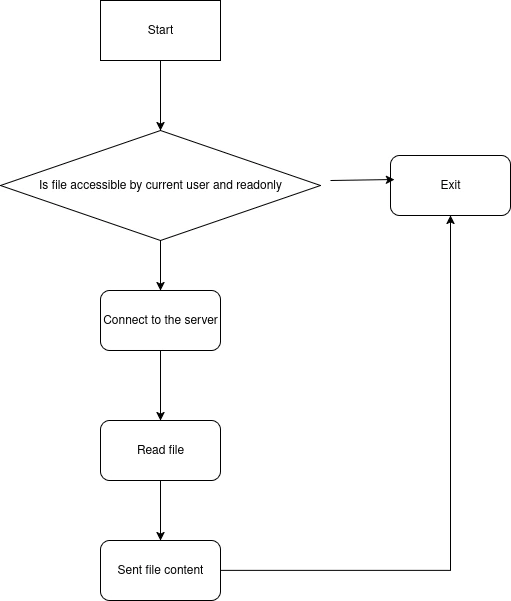

# Level 10
## Start


We can see there is two files. ***level10*** a setuid binary and ***token*** the file that should contain the token.

## First step

First we need to understand how does the binary behave. We used ghidra to decompile it.

```c
int main(int argc,char **argv)

{
  char *__cp;
  uint16_t uVar1;
  int iVar2;
  int iVar3;
  ssize_t sVar4;
  size_t __n;
  int *piVar5;
  char *pcVar6;
  int in_GS_OFFSET;
  undefined4 *in_stack_00000008;
  char *file;
  char *host;
  int fd;
  int ffd;
  int rc;
  char buffer [4096];
  sockaddr_in sin;
  undefined1 local_1024 [4096];
  sockaddr local_24;
  int local_14;
  
  local_14 = *(int *)(in_GS_OFFSET + 0x14);
  if (argc < 3) {
    printf("%s file host\n\tsends file to host if you have access to it\n",*in_stack_00000008);
                    // WARNING: Subroutine does not return
    exit(1);
  }
  pcVar6 = (char *)in_stack_00000008[1];
  __cp = (char *)in_stack_00000008[2];
  iVar2 = access((char *)in_stack_00000008[1],4);
  if (iVar2 == 0) {
    printf("Connecting to %s:6969 .. ",__cp);
    fflush(stdout);
    iVar2 = socket(2,1,0);
    local_24.sa_data[2] = '\0';
    local_24.sa_data[3] = '\0';
    local_24.sa_data[4] = '\0';
    local_24.sa_data[5] = '\0';
    local_24.sa_data[6] = '\0';
    local_24.sa_data[7] = '\0';
    local_24.sa_data[8] = '\0';
    local_24.sa_data[9] = '\0';
    local_24.sa_data[10] = '\0';
    local_24.sa_data[0xb] = '\0';
    local_24.sa_data[0xc] = '\0';
    local_24.sa_data[0xd] = '\0';
    local_24.sa_family = 2;
    local_24.sa_data[0] = '\0';
    local_24.sa_data[1] = '\0';
    local_24.sa_data._2_4_ = inet_addr(__cp);
    uVar1 = htons(0x1b39);
    local_24.sa_data._0_2_ = uVar1;
    iVar3 = connect(iVar2,&local_24,0x10);
    if (iVar3 == -1) {
      printf("Unable to connect to host %s\n",__cp);
                    // WARNING: Subroutine does not return
      exit(1);
    }
    sVar4 = write(iVar2,".*( )*.\n",8);
    if (sVar4 == -1) {
      printf("Unable to write banner to host %s\n",__cp);
                    // WARNING: Subroutine does not return
      exit(1);
    }
    printf("Connected!\nSending file .. ");
    fflush(stdout);
    iVar3 = open(pcVar6,0);
    if (iVar3 == -1) {
      puts("Damn. Unable to open file");
                    // WARNING: Subroutine does not return
      exit(1);
    }
    __n = read(iVar3,local_1024,0x1000);
    if (__n == 0xffffffff) {
      piVar5 = __errno_location();
      pcVar6 = strerror(*piVar5);
      printf("Unable to read from file: %s\n",pcVar6);
                    // WARNING: Subroutine does not return
      exit(1);
    }
    write(iVar2,local_1024,__n);
    iVar2 = puts("wrote file!");
  }
  else {
    iVar2 = printf("You don\'t have access to %s\n",pcVar6);
  }
  if (local_14 != *(int *)(in_GS_OFFSET + 0x14)) {
                    // WARNING: Subroutine does not return
    __stack_chk_fail();
  }
  return iVar2;
}
```

This simple program takes two arguments, a file and a host. 
It checks if the file is readable, then it connects to the host on port 6969 and sends the content of the file.
There is still one catch here. The file must be readonly, not executable nor writable.



## Second step

Reading access documentation we get: `Warning:  Using  access() to check if a user is authorized to, for example, open a file before actually doing so using open(2) creates a security hole, because the user might exploit the short time interval between checking and opening the
       file to manipulate it.  For this reason, the use of this system call should be avoided.  (In the example just described, a safer alternative would be to temporarily switch the process's effective user ID  to  the  real  ID  and  then  call
       open(2).)`
Which means that we can modify the file between the use of access and open. We will use a symlink to do so.

Now the obvious way to do it would be to do something like this:
```bash
while [[ 1 -eq 1 ]]; do
    ln -s <ok_file> <symname>
    rm <symname>
    ln -s <token> <symname>
done
```

And in another terminal run the binary with `<symname>` as file and our host as host
However, is there is a better way do to this ?

Reading the code again we can see that the binary first connects to the host before opening the file. This means we have a way to control the timing between access and open.


Once the exploit written and run, we get the token.

And we lived happily ever after.
The end.