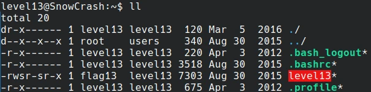
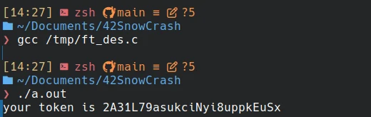

# Start



In this level we must exploit the binary level13.

this binary once decompiled look like this.

```c
#include <string.h>
#include <stdio.h>

typedef unsigned int uint;
typedef unsigned char byte;

char * ft_des(char *param_1)
{
  char cVar1;
  char *pcVar2;
  uint uVar3;
  char *pcVar4;
  byte bVar5;
  uint local_20;
  int local_1c;
  int local_18;
  int local_14;
  
  bVar5 = 0;
  pcVar2 = strdup(param_1);
  local_1c = 0;
  local_20 = 0;
  do {
    uVar3 = 0xffffffff;
    pcVar4 = pcVar2;
    do {
      if (uVar3 == 0) break;
      uVar3 = uVar3 - 1;
      cVar1 = *pcVar4;
      pcVar4 = pcVar4 + (uint)bVar5 * -2 + 1;
    } while (cVar1 != '\0');
    if (~uVar3 - 1 <= local_20) {
      return pcVar2;
    }
    if (local_1c == 6) {
      local_1c = 0;
    }
    if ((local_20 & 1) == 0) {
      if ((local_20 & 1) == 0) {
        for (local_14 = 0; local_14 < "0123456"[local_1c]; local_14 = local_14 + 1) {
          pcVar2[local_20] = pcVar2[local_20] + -1;
          if (pcVar2[local_20] == '\x1f') {
            pcVar2[local_20] = '~';
          }
        }
      }
    }
    else {
      for (local_18 = 0; local_18 < "0123456"[local_1c]; local_18 = local_18 + 1) {
        pcVar2[local_20] = pcVar2[local_20] + '\x01';
        if (pcVar2[local_20] == '\x7f') {
          pcVar2[local_20] = ' ';
        }
      }
    }
    local_20 = local_20 + 1;
    local_1c = local_1c + 1;
  } while( true );
}


void main(void)

{
  __uid_t uid;
  char *pcVar1;
  
  uid = getuid();
  if (uid != 0x1092) {
    uid = getuid();
    printf("UID %d started us but we we expect %d\n",uid,0x1092);
                    /* WARNING: Subroutine does not return */
    exit(1);
  }
  pcVar1 = ft_des("boe]!ai0FB@.:|L6l@A?>qJ}I");
  printf("your token is %s\n",pcVar1);
  return;
}

```

This is quite easy. The main check that you are running the program as user with uid 4242. If this is the case it pass a string through the function ft_des and print it.
The solution is just to use the source we just got from decompiling this program and run it without the check... No need to know what ft_des does.

```c
#include <string.h>
#include <stdio.h>

typedef unsigned int uint;
typedef unsigned char byte;

char * ft_des(char *param_1)
{
  char cVar1;
  char *pcVar2;
  uint uVar3;
  char *pcVar4;
  byte bVar5;
  uint local_20;
  int local_1c;
  int local_18;
  int local_14;
  
  bVar5 = 0;
  pcVar2 = strdup(param_1);
  local_1c = 0;
  local_20 = 0;
  do {
    uVar3 = 0xffffffff;
    pcVar4 = pcVar2;
    do {
      if (uVar3 == 0) break;
      uVar3 = uVar3 - 1;
      cVar1 = *pcVar4;
      pcVar4 = pcVar4 + (uint)bVar5 * -2 + 1;
    } while (cVar1 != '\0');
    if (~uVar3 - 1 <= local_20) {
      return pcVar2;
    }
    if (local_1c == 6) {
      local_1c = 0;
    }
    if ((local_20 & 1) == 0) {
      if ((local_20 & 1) == 0) {
        for (local_14 = 0; local_14 < "0123456"[local_1c]; local_14 = local_14 + 1) {
          pcVar2[local_20] = pcVar2[local_20] + -1;
          if (pcVar2[local_20] == '\x1f') {
            pcVar2[local_20] = '~';
          }
        }
      }
    }
    else {
      for (local_18 = 0; local_18 < "0123456"[local_1c]; local_18 = local_18 + 1) {
        pcVar2[local_20] = pcVar2[local_20] + '\x01';
        if (pcVar2[local_20] == '\x7f') {
          pcVar2[local_20] = ' ';
        }
      }
    }
    local_20 = local_20 + 1;
    local_1c = local_1c + 1;
  } while( true );
}


void main(void)

{
  char *pcVar1;
  
  pcVar1 = ft_des("boe]!ai0FB@.:|L6l@A?>qJ}I");
  printf("your token is %s\n",pcVar1);
  return;
}

```



done